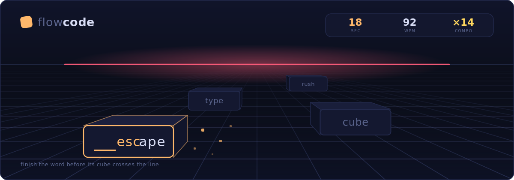

<div align="center">



<br>

**A typing trainer where the words fight back.**

Words fly at you inside 3D cubes and drift toward a red line on the horizon.<br>
Finish each word before its cube crosses it. You set the pace: 20 to 200 words per minute.

### [▶ play now · maybaah.github.io/flowcode](https://maybaah.github.io/flowcode/)

<br>


<a href="LICENSE"></a>

</div>

<br>

## Why

Typing tests measure you. This one *chases* you.

On monkeytype the text sits still and waits; your only opponent is the clock. Here the words have a lifespan. A cube spawns, drifts toward the horizon, and if you haven't finished its word by the time it crosses the red line, it's gone. Miss enough and the run ends.

The flow rate is a slider, not a difficulty preset. Set it to 40 wpm to warm up, or 160 to find out exactly where your hands fall apart.

## Quick start

No install, no bundler, no `node_modules`. Clone and open:

```bash
git clone https://github.com/Maybaah/flowcode.git
cd flowcode
node server.js      # → http://localhost:4173
```

Any static server works, and `index.html` opens straight from disk too.

## How it plays

Just start typing; the first keystroke begins the run.

That first letter **locks onto the nearest matching cube**, and everything you type after goes to that word. Finish it and the cube bursts. There's no clicking, no selecting, no aiming: the closest threat that starts with your letter is the one you get.

| Key | Does |
| :-- | :-- |
| any letter | start the run · lock a cube · type |
| <kbd>space</kbd> | drop the current target and pick a new one |
| <kbd>backspace</kbd> | step back one letter |
| <kbd>tab</kbd> | restart |
| <kbd>esc</kbd> | pause / resume |
| <kbd>enter</kbd> | end the run (while paused) |

## Modes

| Mode | The rule |
| :-- | :-- |
| **time** | Fixed run of 15, 30, 60 or 120 seconds. |
| **words** | Fixed count of 10, 25, 50 or 100 words. |
| **survival** | Three lives, endless flow. Every escaped cube costs one. |
| **flawless** | One typo or one escaped cube and it's over. |
| **rush** | Flow speeds up by 4 wpm every 8 seconds. Three lives. Find your ceiling. |
| **zen** | No timer, no limit, no lives. Stop when you want to. |
| **daily** | The same seeded 60-second run for everyone, every day. English words, no power-ups, and the flow *ramps*: it starts at 45 wpm and climbs 5 wpm every 8 seconds, reaching 80 by the final stretch. Survive the whole minute. |

## Compete: ranked runs and per-mode leaderboards

Every mode except zen has its own **daily leaderboard**. The daily challenge is always ranked; for any other mode, arm the **🏆 ranked** pill and your next run becomes a competition entry: the word sequence is seeded, power-ups and modifiers switch off so every score is comparable, and the results screen shows that mode's board with a one-click submit.

Boards reset at UTC midnight. One row per player per board; resubmitting keeps your best. Each row shows wpm, accuracy, words and the flow the run was played at, so a 200-flow gamble and a 60-flow grind are both visible for what they are.

## Coins and the shop

Finishing a run pays coins: **1 coin per 120 points of score**, plus a **+50 bonus** the first time you finish the daily each day. Spend them in the 🪙 shop on cosmetics:

| Item | Price |
| :-- | :-- |
| sunset theme | 400 🪙 |
| vaporwave theme | 400 🪙 |
| aurum theme | 600 🪙 |
| wireframe cubes | 500 🪙 |
| glass cubes | 500 🪙 |
| magma cubes | 900 🪙 |

Themes recolour everything; cube skins restyle the cubes themselves and stack with any theme. Purchases live in `localStorage`, like every other bit of your data.

## Power-up cubes

Gold cubes appear once a casual run is underway (ranked runs go without). The bonus fires the moment you finish the word.

| | Bonus | Effect |
| :-: | :-- | :-- |
| ❄ | **freeze** | The whole flow stops dead for 3 seconds. |
| 🐌 | **slow motion** | Half speed for 6 seconds. |
| 💥 | **bomb** | Every cube on screen detonates at once. |
| ★ | **double** | Score ×2 for 10 seconds. |
| ♥ | **extra life** | +1 life, or +250 points in modes without lives. |

<br>

<details>
<summary><b>Scoring &amp; stats</b></summary>

<br>

Each word pays `10 + 8 × length`, multiplied by your combo tier; the multiplier climbs one step per 8 chained words and tops out at ×6. Kill a cube while it's still close and the word is worth **1.5×**; a single typo resets the combo to zero.

The results screen gives you:

- **wpm** and **raw**: corrected and uncorrected speed
- **accuracy**: correct keystrokes over total
- **consistency**: how flat your speed curve was, derived from the standard deviation of your per-second wpm
- **chars**, **words**, **escaped**, **max combo**, **score**, **time**
- a **per-second wpm chart** with a dashed average line and red crosses marking every mistake
- a **bar chart of your recent runs**

Personal bests are tracked per mode / length / language / flow rate, so raising the flow doesn't quietly wipe your record. History keeps the last 30 runs. All of it lives in `localStorage`: nothing is uploaded, there is no account, and there is no analytics.

</details>

<details>
<summary><b>Themes</b></summary>

<br>

Five free themes, switchable from the ◐ button, remembered between sessions; three more are sold for coins in the shop.


Every colour in the app (cubes, particles, charts, the horizon glow) is a CSS custom property, so a theme is about a dozen lines in `style.css` and it repaints everything including the canvas charts.

</details>

<details>
<summary><b>How the 3D works</b></summary>

<br>

There is no WebGL and no 3D library. The scene is a CSS `perspective` container with `transform-style: preserve-3d`, and every cube is five plain `<div>` faces (front, top, bottom, and two sides) positioned with `rotateY` / `rotateX` and `translateZ`.

A single `requestAnimationFrame` loop walks the live cubes each tick and writes one `translate3d(x, y, z)` per cube, so depth, the drift toward the horizon, the idle bob and the spawn pop are all one transform. The floor is two `repeating-linear-gradient`s on a plane rotated flat, masked so it dissolves into the fog at the horizon.

Cube lifespan is derived straight from the flow setting: `clamp(260 / wpm, 2.2s, 9s)`. Each cube keeps the speed it was born with, so when the flow ramps mid-run the newer cubes simply fly faster. Cubes spawn across four lanes, never twice in the same lane back to back, and the generator retries to avoid a first letter another cube on screen already claims, so the lock-on stays unambiguous.

</details>

<details>
<summary><b>Word sources: english, russian, code, your own text</b></summary>

<br>

English and Russian lists, roughly 250 common words each, weighted toward short ones. Toggle **@ punct** to fold in punctuation, capitals and the occasional parenthesis, and **# numbers** to mix in numerals. Russian is forgiving about `ё`: typing `е` matches either way.

The third language is **code**: 110 tokens with the symbols real programming makes you type, like `()=>{}`, `arr[i]`, `a!==b`, `try:`, `Vec<T>`, `SELECT`. Brackets, operators and keywords across JS, Python, Rust, C, SQL, shell and HTML.

And **✎ text** lets you paste anything of your own (an article, lyrics, code) and the cubes will carry your words instead.

</details>

<details>
<summary><b>The leaderboards, and why they can't be cheated with devtools</b></summary>

<br>

Optional, and off unless you deploy it; see [`worker/`](worker/). The game itself stays a static site; the leaderboards are a small Cloudflare Worker with a D1 database.

The interesting part is what gets submitted. A browser game can't be trusted to report its own score, so flowcode **doesn't send one**. It sends the keystroke tape (what you typed and when, including target drops and backspaces) and the server decides what it was worth.

That works because a ranked run is fully reproducible: the word list is derived from a seed (the UTC date for the daily, a random seed sent with the run for everything else), cubes spawn on a deterministic cadence, and each keeps the speed it was born with. From the seed and config alone the Worker rebuilds the exact run you played, replays your keystrokes against it with the same lock-on, expiry, lives and combo rules, and computes the score itself. `fetch('/api/submit', {wpm: 9999})` gets you nothing, because there is no wpm field to forge.

Tapes are also checked for physical plausibility: nothing faster than 12 ms between keys, no machine-flat cadence within a word, nothing longer than the time limit, nothing above 300 wpm. A patient bot could still synthesise human-looking timings; this isn't anti-cheat for money, it's anti-cheat for a console one-liner, which is the attack that actually happens.

</details>

<details>
<summary><b>Weak keys &amp; adaptive practice</b></summary>

<br>

Every keystroke is tallied per character, hits and misses separately, merged across runs into `localStorage`. The results screen shows your **weakest keys** ranked by miss rate (once a key has enough presses to mean something).

Turn on **✚ focus** and the word generator starts steering toward your three worst characters: about a third of spawned words are picked to contain them. Ranked runs and the daily ignore focus and custom text so everyone races comparable words.

</details>

<details>
<summary><b>Layout</b></summary>

<br>

```
index.html            markup
style.css             themes, 3D scene, layout, shop
fonts.css             self-hosted @font-face (no CDN)
manifest.webmanifest  PWA manifest
sw.js                 service worker: precache, offline
assets/               hero art, icons, woff2 fonts
js/config.js          leaderboard URL (empty means fully offline)
js/stats.js           pure game math (shared with the server and tests)
js/words.js           word lists, generator, seeded sequences
js/verify.js          run configs + replay verification (shared with the server)
js/game.js            engine: spawn, motion, input, scoring
js/main.js            UI, settings, results, charts, share card, coins, shop
js/leaderboard.js     leaderboard API client
js/audio.js           WebAudio sound effects
server.js             static dev server
worker/               optional Cloudflare Worker + D1 for the leaderboards
tests/                unit tests: node --test tests/stats.test.js tests/verify.test.js
```

</details>

<br>

## Details that matter

- **Works offline.** A service worker precaches everything and the fonts are self-hosted, so after the first visit the game loads with zero network requests. Installable as a PWA.
- **Share card.** One click renders your run (headline wpm, stats, the per-second chart) into a PNG ready to post.
- **Sound with no audio files.** Every effect: keystroke, word burst, combo, miss, game over, new record, is synthesised at runtime with WebAudio oscillators.
- **CapsLock warning**, because a locked CapsLock silently destroys a run.
- **Auto-pause** the moment the window loses focus, so a stray notification doesn't cost you three lives.
- **Touch support**: tap the scene on mobile to summon the keyboard; lanes reflow to fit narrow screens.
- **Reduced-motion aware**: the screen shake respects `prefers-reduced-motion`.
- **Tested.** The scoring math and the replay verifier live in pure modules with a node test suite: `node --test tests/stats.test.js tests/verify.test.js`.

## License

[MIT](LICENSE). Do what you like with it.

<br>

<div align="center">
<sub>Built with vanilla JavaScript and no dependencies · <a href="https://github.com/Maybaah/flowcode">github.com/Maybaah/flowcode</a></sub>
</div>
